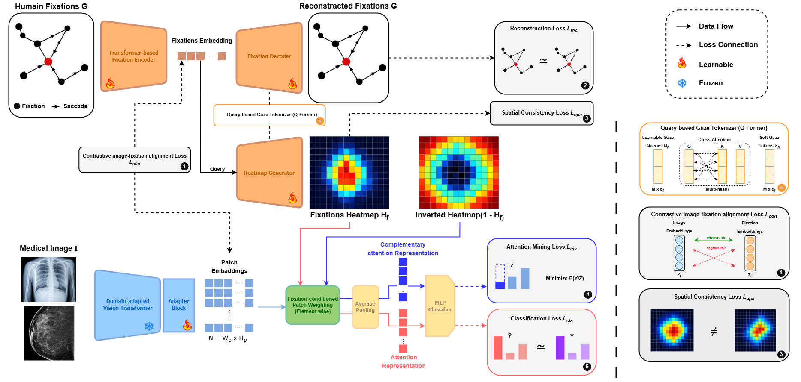

# GazeAlign

**Gaze-Supervised Contrastive Learning for Medical Image Classification**

GazeAlign learns to classify medical images (e.g. chest X-rays) using
radiologists' eye-tracking scanpaths as a weak, free source of spatial
supervision — no pixel-level masks or bounding boxes required. A frozen
vision backbone is paired with a scanpath transformer; their embeddings
are pulled together for matching image/gaze pairs and pushed apart for
mismatched pairs, and a cross-attention module learns to turn a gaze
embedding into a spatial attention mask that highlights the regions an
expert actually looked at before making a diagnosis.



*Figure 1. A frozen image encoder and a scanpath transformer are aligned
via a contrastive loss. A cross-attention mask generator turns the
scanpath embedding into a spatial attention map that re-weights image
patch tokens before classification.*

---

## Quantitative Results

Results below are from the original 3-class chest X-ray experiment
(CHF / Normal / Pneumonia) on MIMIC-Eye. Update this table with your own
numbers when you train on a new dataset or class set — every metric here
is produced by `scripts/run_eval.py`.

<div align=center>
| Metric                       | Value |
| ---------------------------- | ----- |
| Accuracy                     | 86.92% |
| Macro F1                     | 86.17% |
| Macro AUC                    | 94.14% |
</div>

> The fixation-discrimination accuracy measures how reliably the model
> ranks an image's *true* scanpath above mismatched ("negative")
> scanpaths drawn from other images — a diagnostic for the contrastive
> alignment objective, not a clinical metric.

---

## Installation

```bash
git clone https://github.com/MohammedOussamaBEN/GazeAlign.git
cd GazeAlign
pip install -r requirements.txt
```

Requirements: Python ≥ 3.10 · PyTorch ≥ 2.1 · transformers ≥ 4.40 · timm ≥ 1.0.
`pydicom` is only needed if you add a DICOM-based dataset/preset.

---

## Quick Start

### Command-line (single image)

```bash
python scripts/predict_single.py \
    --image examples/images/0c1c6a70-a96f5b27-5d042944-6b49b3b3-fd6a8293.jpg \
    --fixations examples/fixations/fixations.csv \
    --output outputs/output_mask.png \
    --preset cxr
```

Add `--save_overlay` to also get a colour overlay and a standalone
gaze-prior PNG:

```bash
python scripts/predict_single.py \
    --image examples/images/0c1c6a70-a96f5b27-5d042944-6b49b3b3-fd6a8293.jpg \
    --fixations examples/fixations/fixations.csv \
    --output outputs/output_mask.png \
    --preset cxr \
    --save_overlay
```

The script prints the predicted class and per-class probabilities, and
saves:

- `output_mask.png` — the model's learned gaze-conditioned attention mask
- `output_mask_overlay.png` — the mask blended over the original image (with `--save_overlay`)
- `output_mask_gaze_prior.png` — the raw fixation Gaussian-splat, for comparison (with `--save_overlay`)

To run on a new modality/dataset, add a preset to `configs/presets.yaml`
pointing at your own checkpoint and class list, then pass
`--preset <your_preset_name>`.

### Python API

```python
from scripts.predict_single import GazeAlignPredictor

predictor = GazeAlignPredictor.from_preset("cxr", presets_path="configs/presets.yaml")
result = predictor.predict(
    "examples/images/0c1c6a70-a96f5b27-5d042944-6b49b3b3-fd6a8293.jpg",
    "examples/fixations/fixations.csv",
)

print(result.predicted_class)   # e.g. "pneumonia"
print(result.class_probs)       # {"CHF": 0.05, "Normal": 0.12, "pneumonia": 0.83}
result.attention_mask           # np.ndarray [H, W] in [0, 1], learned gaze-conditioned mask
result.gaze_prior               # np.ndarray [H, W] in [0, 1], raw fixation heatmap
```

### Training

```bash
python scripts/train.py --config configs/mimic_cxr.yaml
```

Expects a dataset directory laid out as:

```
mimic_part_jpg/
├── train/<class_name>/*.jpg
├── test/<class_name>/*.jpg
└── gaze/
    ├── eye_gaze.csv      # used for visualization overlays
    └── fixations.csv     # used for training (the scanpath signal)
```

Class names and all hyperparameters live in `configs/mimic_cxr.yaml` —
copy it and edit `data.classes` / `data.base_path` to train on your own
dataset without touching any code.

### Evaluation

```bash
python scripts/run_eval.py \
    --config configs/mimic_cxr.yaml \
    --checkpoint checkpoints/best_model.pth \
    --split test \
    --output results.json
```

---

## Repository Structure

```
GazeAlign/
├── GazeAlign/                     # core library
│   ├── backbone.py                # frozen DINOv3/RAD-DINO wrapper + trainable extra block
│   ├── gaze.py                    # scanpath loading + fixation heatmaps
│   ├── model.py                   # ScanpathTransformer, ViTMaskGenerator, classifier head
│   ├── losses.py                  # contrastive, scanpath-matching, mask-consistency, attention-mining losses
│   ├── engine.py                  # GazeAlignModel: shared train/val forward pass
│   ├── datasets.py                # MIMIC-CXR-style gaze dataset loader (+ extensible registry)
│   ├── metrics.py                 # classification + fixation-discrimination metrics
│   ├── visualize.py               # debug figures + overlays
│   ├── utils.py                   # config loading, seeding
│   └── constants.py               # IMG_SIZE, GRID_SIZE, column names
├── configs/
│   ├── mimic_cxr.yaml             # training hyperparameters for the 3-class CXR setup
│   └── presets.yaml               # inference presets (checkpoint + classes per modality)
├── scripts/
│   ├── train.py                   # full training loop
│   ├── run_eval.py                # full-dataset evaluation loop
│   └── predict_single.py          # ← single-image CLI + Python API (start here)
├── notebooks/
│   └── GazeAlign_Demo.ipynb       # step-by-step pipeline walkthrough
├── huggingface_space/
│   ├── app.py                     # Gradio demo (upload → click to add fixations → predict)
│   ├── README.md                  # Space card with YAML front-matter
│   └── requirements.txt
├── examples/
│   ├── images/
│   │   └── 0c1c6a70-a96f5b27-5d042944-6b49b3b3-fd6a8293.jpg   # example chest X-ray
│   ├── fixations/
│   │   └── fixations.csv          # ready-to-run example (pixel coords, MIMIC format)
│   └── README.md                  # CSV format spec + usage guide
├── assets/
│   └── archi.png                  # Figure 1 for this README
└── requirements.txt
```

---

## How It Works

1. **Image encoding** (`GazeAlign.backbone.DINOv3Encoder`): a frozen
   RAD-DINO/DINOv3 backbone produces patch tokens and a [CLS] token; one
   additional trainable transformer block (attention-only, MLP removed)
   sits on top so the model can adapt without fully fine-tuning a large
   pretrained network on a small gaze dataset.

2. **Scanpath encoding** (`GazeAlign.model.ScanpathTransformer`): a
   transformer encoder-decoder ingests the (x, y, t) fixation sequence
   and produces a single embedding, trained both to reconstruct the
   scanpath (via a Hungarian-matched spatial+temporal loss) and to align
   with the matching image embedding.

3. **Gaze-conditioned masking** (`GazeAlign.model.ViTMaskGenerator`): a
   bank of learnable per-patch queries cross-attends to the scanpath
   embedding, producing a `[37, 37]` attention mask that re-weights the
   image's patch tokens before classification.

4. **Classification**: the gaze-weighted patch features are pooled and
   passed through a multi-head classifier. An *attention-mining* loss
   additionally penalizes the model if the class can still be predicted
   from the **un**-attended region — pushing discriminative evidence
   into the gaze-attended area.

5. **Contrastive alignment**: image and scanpath embeddings are pulled
   together for true pairs and pushed apart from `K` mismatched
   ("negative") scanpaths sampled from other images in the batch.

See `GazeAlign/engine.py` for exactly how these pieces combine into the
total training loss, and `GazeAlign/losses.py` for each loss term's
docstring.

---

## Citation

```bibtex
@inproceedings{gazealign2026,
  title   = {GazeAlign: Gaze-Supervised Contrastive Learning
             for Medical Image Classification},
  author  = {...},
  year    = {2026}
}
```

## License

This project is released under the [MIT License](LICENSE).
